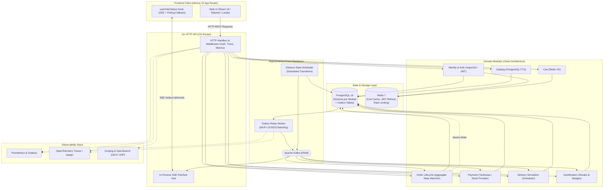

# Avari Dofamine (Dofamine Market)

<div align="center">


### **The Safe Dofamine Shopping Simulator & Production-Grade Engineering Showcase**

[](https://golang.org)
[-000000?style=for-the-badge&logo=next.js&logoColor=white)](https://nextjs.org)
[](https://www.typescriptlang.org)
[](https://tailwindcss.com)
[](https://www.postgresql.org)
[](https://redis.io)
[](https://kafka.apache.org)
[](https://opentelemetry.io)
[](https://www.docker.com)
[](docs/adr/004-module-boundaries.md)

**🌐 English** | **[🇷🇺 Русская версия (README_RU.md)](README_RU.md)**

</div>

---

## 📖 Table of Contents

- [✨ Product Vision & Psychology](#-product-vision--psychology)
- [🖼️ Application Showcase & UI](#️-application-showcase--ui)
- [🏛️ Architectural Highlights & Engineering Innovations](#️-architectural-highlights--engineering-innovations)
- [📐 System Architecture](#-system-architecture)
- [🛠️ Tech Stack](#️-tech-stack)
- [📂 Repository Structure](#-repository-structure)
- [🚀 Quick Start & Local Development](#-quick-start--local-development)
- [🧪 Quality Gates & Verification](#-quality-gates--verification)
- [📚 Documentation & Architecture Decision Records](#-documentation--architecture-decision-records)

---

## ✨ Product Vision & Psychology

**Avari Dofamine** is an interactive, full-cycle marketplace and delivery simulation engineered around a specific psychological insight:

> **Users frequently browse and shop online not for the physical items, but for the anticipation and the ritual itself:**
> *(Search ➔ Discovery ➔ Add to Cart ➔ Checkout ➔ Real-time Waiting ➔ Delivery Arrival ➔ Triumph)*

Real-world e-commerce involves impulse spending, buyer's remorse, and heavy logistical footprints. **Avari Dofamine** turns this ritual into a playful, controlled, and guilt-free micro-reward experience:

- 🪙 **Invariant Pricing (`INV-01`)**: Every order costs exactly **10.00 RUB**, regardless of whether the cart contains a cup of coffee or a high-end gadget.
- 📍 **Procedural Geodesic Pickups (`INV-03`)**: Generates 5–8 realistic pickup points within a 100–500m radius of the user's real browser coordinates using spherical trigonometry.
- ⏱️ **Deterministic Delivery State Machine (`ADR-005`)**: Simulates realistic dispatching, courier travel, and arrival with sub-minute schedules, pushed in real time via Server-Sent Events (SSE).
- 🏆 **Gamification & Habit Layer**: Real-time streak calculation with timezone awareness, celebratory confetti modals, and collectible achievement badges.

As an engineering artifact, this project demonstrates the complete lifecycle of production software engineering: **PRD ➔ 12 Architecture Decision Records (ADR) ➔ Agentic Constitution (`AGENTS.md`) ➔ Modular Go Monolith ➔ Next.js 15 SSR Frontend ➔ Full Observability Stack.**

---

## 🖼️ Application Showcase & UI

<div align="center">

### 1. 🛍️ Synthetic Catalog & Full-Text Search
*PostgreSQL FTS, category filters, responsive cards with instant micro-interactions and dark-mode glassmorphism.*
<br/><br/>


<br/><br/>

### 2. 🚚 Real-Time Delivery Tracker
*Live Server-Sent Events (SSE) streaming state machine updates, step-by-step progress, courier telemetry, and ETA countdown.*
<br/><br/>


<br/><br/>

### 3. 🛒 Cart & Fixed 10₽ Pricing Invariant
*Cart VO backed by Redis (7-day TTL), enrichment via lookup contracts, and the strict 10 RUB flat checkout banner.*
<br/><br/>


<br/><br/>

### 4. 🏆 Gamification & Milestone Rewards
*Immediate celebratory feedback on order completion, dynamic level progression, and unlockable achievements.*
<br/><br/>


<br/><br/>

### 5. ⚡ Profile, Daily Streaks & Badges
*Order history with deep inspection, daily streak tracking with timezone offsets, and achievement trophy showcase.*
<br/><br/>


</div>

---

## 🏛️ Architectural Highlights & Engineering Innovations

### 1. Modular Monolith with Strict Boundaries (`ADR-001`, `ADR-004`)
- **No Cross-Module Coupling**: Go packages inside `internal/modules/X` are strictly prohibited from importing `internal/modules/Y`. Inter-module communication occurs **exclusively** via synchronous Go contracts (`internal/contracts/*`) or asynchronous Kafka events.
- **Architectural Linter**: Enforced via `depguard` in `.golangci.yml` and verified in CI (`make lint-arch`). Any boundary violation instantly fails the pipeline.
- **Clean Architecture**: Clean separation between `domain/` (pure Go business logic, 0 external imports), `port/` (interfaces), `usecase/` (application logic), and `adapter/` (Postgres, Redis, Kafka, HTTP).

### 2. Transactional Outbox Pattern & Event-Driven Backbone (`ADR-003`)
- **Atomic Operations**: State updates and corresponding domain events are written to PostgreSQL in the exact same database transaction (`order.outbox`).
- **Guaranteed Delivery**: A dedicated background worker (`apps/api/cmd/worker`) polls the outbox with `SELECT ... FOR UPDATE SKIP LOCKED` and publishes to Apache Kafka (KRaft mode).
- **Idempotent Consumers**: Every consumer verifies event uniqueness against `processed_events` tables before execution, preventing duplicate side-effects.

### 3. Fault-Tolerant Delivery State Machine (`ADR-005`)
- **Zero In-Memory Timers**: Real-world backend services can crash or scale horizontally. Timers are stored in `delivery.scheduled_transitions` in PostgreSQL rather than Go goroutines with `time.Sleep`.
- **Worker Recovery**: If the service restarts, the background scheduler picks up pending transitions exactly when their execution timestamp arrives.

### 4. Real-Time Server-Sent Events (SSE) Engine (`ADR-009`)
- **Lightweight & Battery-Friendly**: Instead of heavy bidirectional WebSockets, the order tracking UI subscribes to `/api/v1/orders/{id}/events` via standard HTTP SSE.
- **In-Process Pub/Sub**: Broadcasts instant domain events with an initial snapshot and keep-alive heartbeats. Fallback to polling ensures resilience across network interruptions.

### 5. Spherical Geodesic Calculations (`ADR-012`)
- Computes genuine spatial destination points on Earth's sphere using great-circle formulas ($R = 6371\text{ km}$), generating realistic addresses and pickup coordinates within $[100\text{m}, 500\text{m}]$ from user coordinates.

### 6. Production-Grade Observability (`ADR-010`)
- **Distributed Tracing**: OpenTelemetry traces propagated across HTTP request headers and Kafka `traceparent` metadata.
- **Metrics**: Native Prometheus `/metrics` endpoint tracking request latency, order state transitions, and outbox throughput.
- **Structured Logging**: `slog` with GELF UDP transport into Graylog + OpenSearch.

---

## 📐 System Architecture



---

## 🛠️ Tech Stack

| Layer | Technology | Key Details & Rationale |
|---|---|---|
| **Frontend** | **Next.js 15 (App Router)** | Server Components (RSC), React 19, TypeScript strict mode |
| **Styling & UI** | **Tailwind CSS + Glassmorphism** | Custom dark palette (`#050B14`), micro-animations, canvas confetti |
| **Backend** | **Go 1.23+** | Modular monolith, Chi router, `sqlc` type-safe queries, `goose` migrations |
| **Primary Database** | **PostgreSQL 16** | Module-isolated schemas (`auth`, `catalog`, `orders`, `delivery`, etc.) |
| **Caching & Fast KV** | **Redis 7** | Cart VO with 7-day TTL, refresh token rotation, sliding-window rate limiting |
| **Event Streaming** | **Apache Kafka (KRaft)** | Transactional Outbox relay, exactly-once idempotency via `processed_events` |
| **Authentication** | **Argon2id + JWT Family** | Secure password hashing, 15m Access Token, 30d Refresh Token with reuse detection |
| **Telemetry & Logs** | **OpenTelemetry + Prometheus + GELF** | W3C traceparent propagation, Prometheus `/metrics`, Graylog log aggregation |
| **Infrastructure** | **Docker Compose** | Single-command local dev environment with healthchecks |

---

## 📂 Repository Structure

```
avari-dofamine/
├── AGENTS.md                  # Constitution for autonomous AI development
├── Makefile                   # Root automation: dev, test, lint, migrate, seed
├── deploy/
│   └── docker-compose.yml     # Postgres, Redis, Kafka (KRaft), Graylog, OpenSearch, Jaeger
├── docs/
│   ├── prd/PRD.md             # Machine-readable Product Requirements Document
│   ├── adr/                   # 12 Architecture Decision Records (001 to 012)
│   ├── epics/                 # 15 detailed implementation epics (EPIC-00 to EPIC-14)
│   └── design/                # Design system spec and high-res UI screenshots
├── apps/
│   ├── web/                   # Next.js 15 SSR Frontend application
│   │   ├── app/               # App Router pages (catalog, cart, orders, profile, onboarding)
│   │   ├── components/        # UI components, layout, features
│   │   ├── hooks/             # Custom hooks (useOrderStatus SSE client)
│   │   └── lib/               # API clients, auth context, generated OpenAPI types
│   └── api/                   # Go backend service (Modular Monolith)
│       ├── cmd/
│       │   ├── server/        # HTTP API entrypoint (port 8080)
│       │   ├── worker/        # Outbox relay & delivery scheduler daemon
│       │   ├── migrator/      # Embedded goose migration runner
│       │   └── seed/          # Synthetic catalog & user seeding
│       └── internal/
│           ├── contracts/     # Public Go interfaces decoupling modules
│           ├── platform/      # Shared infra (database, redis, kafka, logger, tracer)
│           └── modules/       # Domain modules (identity, catalog, cart, order, delivery...)
```

---

## 🚀 Quick Start & Local Development

### Prerequisites
- **Docker & Docker Compose** (v24+)
- **Go** (1.23+)
- **Node.js** (v20+) & **pnpm** (v9+)

### 1. Clone & Configure Environment
```bash
git clone https://github.com/OstKost/avari-dofamine.git
cd avari-dofamine

# Create local environment config
cp .env.example .env
```

### 2. Start Infrastructure
Launch PostgreSQL, Redis, Kafka (KRaft), and Observability services in Docker:
```bash
make dev-infra
```
*(Wait a few seconds until all containers report healthy status: `docker compose -f deploy/docker-compose.yml ps`)*

### 3. Run Migrations & Seed Synthetic Data
```bash
# Run schema migrations across all domain modules
make migrate-up

# Seed 200+ synthetic products and categories
make seed-catalog
```

### 4. Start Full Development Stack
Run the Go API server, background worker, and Next.js frontend concurrently:
```bash
make dev
```

Now open:
- 🌐 **Web Frontend**: [http://localhost:3000](http://localhost:3000)
- 🔌 **API Healthcheck**: [http://localhost:8080/healthz](http://localhost:8080/healthz)
- 📊 **Prometheus Metrics**: [http://localhost:8080/metrics](http://localhost:8080/metrics)

---

## 🧪 Quality Gates & Verification

The project is protected by strict quality gates configured in the root `Makefile` and GitHub Actions CI:

```bash
# Run all unit and race-condition tests across Go and Web
make test

# Verify strict architectural module boundaries (depguard)
make lint-arch

# Run comprehensive linters (golangci-lint + ESLint)
make lint
```

---

## 📚 Documentation & Architecture Decision Records

Every single architectural trade-off and product decision is formally documented in machine-readable ADRs:

- [`ADR-001: Modular Monolith Architecture`](docs/adr/001-modular-monolith.md)
- [`ADR-002: Single-Node Infrastructure Topology`](docs/adr/002-single-node-infra.md)
- [`ADR-003: Transactional Outbox Pattern with Kafka`](docs/adr/003-event-driven-outbox.md)
- [`ADR-004: Enforcing Module Boundaries via Depguard`](docs/adr/004-module-boundaries.md)
- [`ADR-005: Delivery State Machine via Scheduled Transitions`](docs/adr/005-delivery-state-machine.md)
- [`ADR-006: Payment Gateway Abstraction & Mocking`](docs/adr/006-payment-abstraction.md)
- [`ADR-007: JWT Sessions & Refresh Family Token Rotation`](docs/adr/007-auth-jwt-sessions.md)
- [`ADR-008: Redis-Backed Ephemeral Shopping Cart`](docs/adr/008-cart-in-redis.md)
- [`ADR-009: Next.js SSR + Real-time Streaming via SSE`](docs/adr/009-nextjs-ssr-realtime.md)
- [`ADR-010: Production Observability Stack (Graylog/OTel/Prometheus)`](docs/adr/010-observability-graylog.md)
- [`ADR-011: Isolated Database Schemas per Domain Module`](docs/adr/011-db-per-module-schema.md)
- [`ADR-012: Synthetic Catalog & Geodesic Pickup Points Generation`](docs/adr/012-synthetic-data-generation.md)

---

<div align="center">

Crafted with ⚡ and engineering precision by **[OstKost](https://github.com/OstKost)**

</div>
