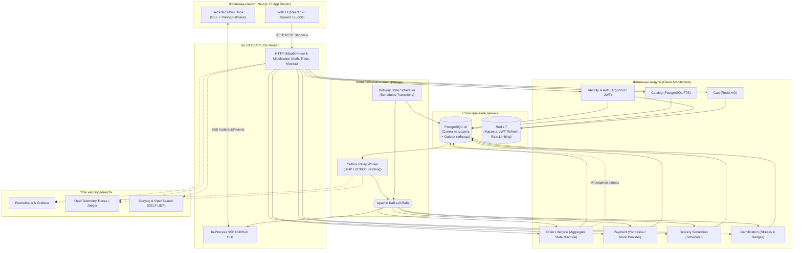

# Avari Dopamine (Dopamine Market)

<div align="center">


### **Симулятор безопасного дофаминового шопинга & Портфолио production-grade инженерии**

[](https://golang.org)
[-000000?style=for-the-badge&logo=next.js&logoColor=white)](https://nextjs.org)
[](https://www.typescriptlang.org)
[](https://tailwindcss.com)
[](https://www.postgresql.org)
[](https://redis.io)
[](https://kafka.apache.org)
[](https://opentelemetry.io)
[](https://www.docker.com)
[](docs/adr/004-module-boundaries.md)

**[English Version (README.md)](README.md)** | **🌐 Русская версия**

</div>

---

## 📖 Оглавление

- [✨ Продуктовое видение и психология](#-продуктовое-видение-и-психология)
- [🖼️ Галерея интерфейса и скриншоты](#️-галерея-интерфейса-и-скриншоты)
- [🏛️ Ключевые инженерные решения и архитектура](#️-ключевые-инженерные-решения-и-архитектура)
- [📐 Архитектурная схема системы](#-архитектурная-схема-системы)
- [🛠️ Технологический стек](#️-технологический-стек)
- [📂 Структура репозитория](#-структура-репозитория)
- [🚀 Быстрый старт и локальная разработка](#-быстрый-старт-и-локальная-разработка)
- [🧪 Quality Gates и тестирование](#-quality-gates-и-тестирование)
- [📚 Документация и Architecture Decision Records (ADR)](#-документация-и-architecture-decision-records-adr)

---

## ✨ Продуктовое видение и психология

**Avari Dopamine** — это интерактивный симулятор маркетплейса и доставки еды полного цикла, спроектированный на стыке продуктовой психологии и высоконагруженной бэкенд-инженерии:

> **Продуктовая гипотеза:** Пользователям часто нужен не сам физический товар, а **эмоциональный ритуал ожидания и покупки:**
> *(Поиск ➔ Находка ➔ Наполнение корзины ➔ Оплата ➔ Трекинг курьера в реальном времени ➔ Триумф получения)*

Реальный e-commerce сопряжён с импульсивными тратами, чувством вины и сложной физической логистикой. **Avari Dopamine** превращает этот ритуал в управляемый, безопасный и чистый источник дофамина:

- 🪙 **Фиксированная цена заказа (`INV-01`)**: Любой заказ стоит ровно **10.00 ₽**, независимо от того, лежит в корзине чашка кофе или флагманский гаджет.
- 📍 **Геодезическая генерация ПВЗ (`INV-03`)**: Процедурная генерация 5–8 реалистичных пунктов выдачи в радиусе 100–500 м от реальной геопозиции пользователя через сферическую тригонометрию.
- ⏱️ **Детерминированная стейт-машина доставки (`ADR-005`)**: Честная симуляция этапов сборки, выезда курьера и прибытия по расписанию в БД, транслируемая в реальном времени через Server-Sent Events (SSE).
- 🏆 **Слой геймификации и привычек**: Подсчёт ежедневного стрика с учётом часовых поясов, триумфальные конфетти-модалки и коллекция ачивок/бейджей.

Как инженерный проект, репозиторий демонстрирует полный цикл разработки Enterprise-уровня: **Машиночитаемый PRD ➔ 12 Architecture Decision Records (ADR) ➔ Конституция агентной разработки (`AGENTS.md`) ➔ Модульный монолит на Go ➔ Next.js 15 SSR фронтенд ➔ Полный стек Observability (OTel, Prometheus, Graylog).**

---

## 🖼️ Галерея интерфейса и скриншоты

<div align="center">

### 1. 🛍️ Синтетический каталог и полнотекстовый поиск
*PostgreSQL FTS, фильтрация по категориям, интерактивные карточки с микроанимациями и темная glassmorphism палитра.*
<br/><br/>


<br/><br/>

### 2. 🚚 Трекер доставки в реальном времени
*Потоковая доставка состояний через SSE, пошаговый прогресс-бар, телеметрия виртуального курьера и таймер прибытия.*
<br/><br/>


<br/><br/>

### 3. 🛒 Корзина и баннер инварианта 10₽
*Иммутабельный Cart Value Object в Redis (TTL 7 дней), обогащение данными через контракты и честная плашка фиксированной стоимости.*
<br/><br/>


<br/><br/>

### 4. 🏆 Геймификация и награды за покупки
*Моментальный позитивный отклик при завершении заказа, прогресс уровней и открытие новых достижений.*
<br/><br/>


<br/><br/>

### 5. ⚡ Профиль, ежедневные стрики и бейджи
*Детальная история заказов, трекинг активных дней с компенсацией TimeZone и витрина разблокированных трофеев.*
<br/><br/>


</div>

---

## 🏛️ Ключевые инженерные решения и архитектура

### 1. Модульный монолит с жесткими границами (`ADR-001`, `ADR-004`)
- **Полная изоляция модулей**: Прямой импорт пакетов `internal/modules/X` в `internal/modules/Y` аппаратно **запрещён**. Взаимодействие между модулями происходит **только** через синхронные Go-интерфейсы (`internal/contracts/*`) или через события Kafka.
- **Архитектурный линтинг в CI**: Правило `depguard` встроено в `.golangci.yml` и проверяется командой `make lint-arch`. Любое нарушение границы прерывает CI.
- **Чистая архитектура (Clean Architecture)**: Внутри каждого модуля строго разделены `domain/` (чистый Go без инфраструктурных зависимостей), `port/` (интерфейсы репозиториев и сервисов), `usecase/` (сценарии приложения) и `adapter/` (Postgres, Redis, HTTP, Kafka).

### 2. Transactional Outbox Pattern и Kafka Backbone (`ADR-003`)
- **Атомарность сохранения**: Изменение состояния агрегата и запись события в таблицу `order.outbox` выполняются в рамках **одной ACID-транзакции** PostgreSQL.
- **Гарантированная доставка**: Фоновый воркер опрашивает outbox пакетным запросом `SELECT ... FOR UPDATE SKIP LOCKED` и публикует события в Apache Kafka (KRaft).
- **Идемпотентные консьюмеры**: Все обработчики событий проверяют уникальность `event_id` по таблицам `processed_events`, исключая дублирование бизнес-действий.

### 3. Отказоустойчивая стейт-машина доставки (`ADR-005`)
- **Никаких in-memory таймеров**: Обычные `time.Sleep` и горутины погибают при рестарте пода. В Avari Dopamine переходы планируются в таблице `delivery.scheduled_transitions` в PostgreSQL.
- **Автоматическое восстановление**: При падении или перезапуске воркера планировщик просто выбирает наступившие события и продолжает симуляцию без потери данных.

### 4. Потоковый Real-Time SSE (Server-Sent Events) (`ADR-009`)
- **Легковесность и надежность**: Вместо тяжелых двунаправленных WebSockets используется однонаправленный HTTP SSE стрим `/api/v1/orders/{id}/events`.
- **In-process Pub/Sub**: Мгновенный бродкаст событий с отправкой начального снапшота и heartbeat-пакетов. Клиентский хук `useOrderStatus` автоматически переключается на polling при обрыве связи.

### 5. Сферическая геодезия для синтетических данных (`ADR-012`)
- Расчёт координат пунктов выдачи по формулам прямого геодезического пути на сфере Земли ($R = 6371\text{ км}$), что создает честное смещение $[100\text{м}, 500\text{м}]$ относительно реальных координат пользователя.

### 6. Observability промышленного уровня (`ADR-010`)
- **Distributed Tracing**: OpenTelemetry трейсы сквозным образом пробрасываются через HTTP-заголовки и метаданные сообщений Kafka (`traceparent`).
- **Бизнес-метрики**: Нативный Prometheus-эндпоинт `/metrics` для мониторинга RPS, latency, переходов стейт-машины и лага outbox.
- **Структурные логи**: `slog` с отправкой по протоколу GELF UDP напрямую в кластер Graylog + OpenSearch.

---

## 📐 Архитектурная схема системы



---

## 🛠️ Технологический стек

| Слой | Технология | Обоснование и детали |
|---|---|---|
| **Frontend** | **Next.js 15 (App Router)** | Серверные компоненты (RSC), React 19, TypeScript strict mode |
| **Стилизация & UI** | **Tailwind CSS + Glassmorphism** | Кастомная палитра `#050B14`, микроанимации, canvas-confetti |
| **Backend** | **Go 1.23+** | Модульный монолит, роутер Chi, типобезопасный `sqlc`, миграции `goose` |
| **Основная БД** | **PostgreSQL 16** | Изолированные схемы под каждый модуль (`auth`, `catalog`, `orders`, `delivery`) |
| **Кэш и быстрые KV** | **Redis 7** | Cart Value Object с TTL 7 дней, ротация JWT refresh сессий, rate limiting |
| **Очередь сообщений** | **Apache Kafka (KRaft)** | Transactional Outbox релей, идемпотентная обработка через `processed_events` |
| **Безопасность & Auth** | **Argon2id + JWT Family** | Стойкое хеширование паролей, 15m Access Token, 30d Refresh Token с reuse detection |
| **Телеметрия и логи** | **OpenTelemetry + Prometheus + GELF** | Сквозной контекст W3C `traceparent`, метрики `/metrics`, Graylog логирование |
| **Инфраструктура** | **Docker Compose** | Развертывание всего окружения одной командой с healthchecks |

---

## 📂 Структура репозитория

```
avari-dopamine/
├── AGENTS.md                  # Конституция агентной разработки (правила и инварианты)
├── Makefile                   # Главный файл автоматизации: dev, test, lint, migrate, seed
├── deploy/
│   └── docker-compose.yml     # Postgres, Redis, Kafka (KRaft), Graylog, OpenSearch, Jaeger
├── docs/
│   ├── prd/PRD.md             # Машиночитаемый Product Requirements Document
│   ├── adr/                   # 12 Architecture Decision Records (001–012)
│   ├── epics/                 # 15 детализированных эпиков разработки (EPIC-00..EPIC-14)
│   └── design/                # Спецификация дизайн-системы и Hi-Res скриншоты
├── apps/
│   ├── web/                   # Next.js 15 SSR фронтенд-приложение
│   │   ├── app/               # Маршруты App Router (catalog, cart, orders, profile...)
│   │   ├── components/        # UI-компоненты, layout, фичи
│   │   ├── hooks/             # Хуки (useOrderStatus SSE клиент)
│   │   └── lib/               # API клиенты, auth context, сгенерированные OpenAPI типы
│   └── api/                   # Go бэкенд сервис (модульный монолит)
│       ├── cmd/
│       │   ├── server/        # Точка входа HTTP API (порт 8080)
│       │   ├── worker/        # Фоновый демон Outbox релея и планировщика доставки
│       │   ├── migrator/      # Запуск встроенных SQL-миграций goose
│       │   └── seed/          # Сидирование синтетического каталога
│       └── internal/
│           ├── contracts/     # Публичные Go интерфейсы межмодульной развязки
│           ├── platform/      # Общая инфраструктура (db, redis, kafka, logger, tracer)
│           └── modules/       # Доменные модули (identity, catalog, cart, order, delivery...)
```

---

## 🚀 Быстрый старт и локальная разработка

### Системные требования
- **Docker & Docker Compose** (v24+)
- **Go** (1.23+)
- **Node.js** (v20+) и **pnpm** (v9+)

### 1. Клонирование и настройка окружения
```bash
git clone https://github.com/OstKost/avari-dopamine.git
cd avari-dopamine

# Создание конфигурации окружения
cp .env.example .env
```

### 2. Запуск инфраструктуры
Поднятие PostgreSQL, Redis, Kafka (KRaft) и стека наблюдаемости в Docker:
```bash
make dev-infra
```
*(Подождите несколько секунд до перехода контейнеров в состояние healthy: `docker compose -f deploy/docker-compose.yml ps`)*

### 3. Применение миграций и сидирование данных
```bash
# Применение миграций всех модулей
make migrate-up

# Сидирование 200+ синтетических товаров и категорий
make seed-catalog
```

### 4. Запуск всего стека разработки
Запуск HTTP API сервера, фонового воркера и фронтенда параллельно:
```bash
make dev
```

Сервисы готовы к работе:
- 🌐 **Web Frontend**: [http://localhost:3000](http://localhost:3000)
- 🔌 **API Healthcheck**: [http://localhost:8080/healthz](http://localhost:8080/healthz)
- 📊 **Prometheus Метрики**: [http://localhost:8080/metrics](http://localhost:8080/metrics)

---

## 🧪 Quality Gates и тестирование

Проект защищён строгими проверками качества в `Makefile` и GitHub Actions CI:

```bash
# Запуск всех юнит-тестов с детектором гонок (-race)
make test

# Проверка архитектурных границ модулей (depguard)
make lint-arch

# Полный статический анализ (golangci-lint + ESLint)
make lint
```

---

## 📚 Документация и Architecture Decision Records (ADR)

Каждое инженерное решение и компромисс зафиксированы в машиночитаемых ADR:

- [`ADR-001: Архитектура модульного монолита`](docs/adr/001-modular-monolith.md)
- [`ADR-002: Топология инфраструктуры на одном хосте`](docs/adr/002-single-node-infra.md)
- [`ADR-003: Transactional Outbox паттерн с Kafka`](docs/adr/003-event-driven-outbox.md)
- [`ADR-004: Контроль границ модулей через Depguard`](docs/adr/004-module-boundaries.md)
- [`ADR-005: Стейт-машина доставки на отложенных транзишенах в БД`](docs/adr/005-delivery-state-machine.md)
- [`ADR-006: Абстракция и мокирование платежных шлюзов`](docs/adr/006-payment-abstraction.md)
- [`ADR-007: JWT-сессии и ротация Refresh токенов`](docs/adr/007-auth-jwt-sessions.md)
- [`ADR-008: Хранение эфемерной корзины в Redis`](docs/adr/008-cart-in-redis.md)
- [`ADR-009: Next.js SSR и Real-time стриминг через SSE`](docs/adr/009-nextjs-ssr-realtime.md)
- [`ADR-010: Стек наблюдаемости (Graylog, OpenTelemetry, Prometheus)`](docs/adr/010-observability-graylog.md)
- [`ADR-011: Изолированные схемы PostgreSQL на каждый модуль`](docs/adr/011-db-per-module-schema.md)
- [`ADR-012: Генерация синтетического каталога и геодезия ПВЗ`](docs/adr/012-synthetic-data-generation.md)

---

<div align="center">

Разработано с ⚡ и инженерной точностью: **[OstKost](https://github.com/OstKost)**

</div>
